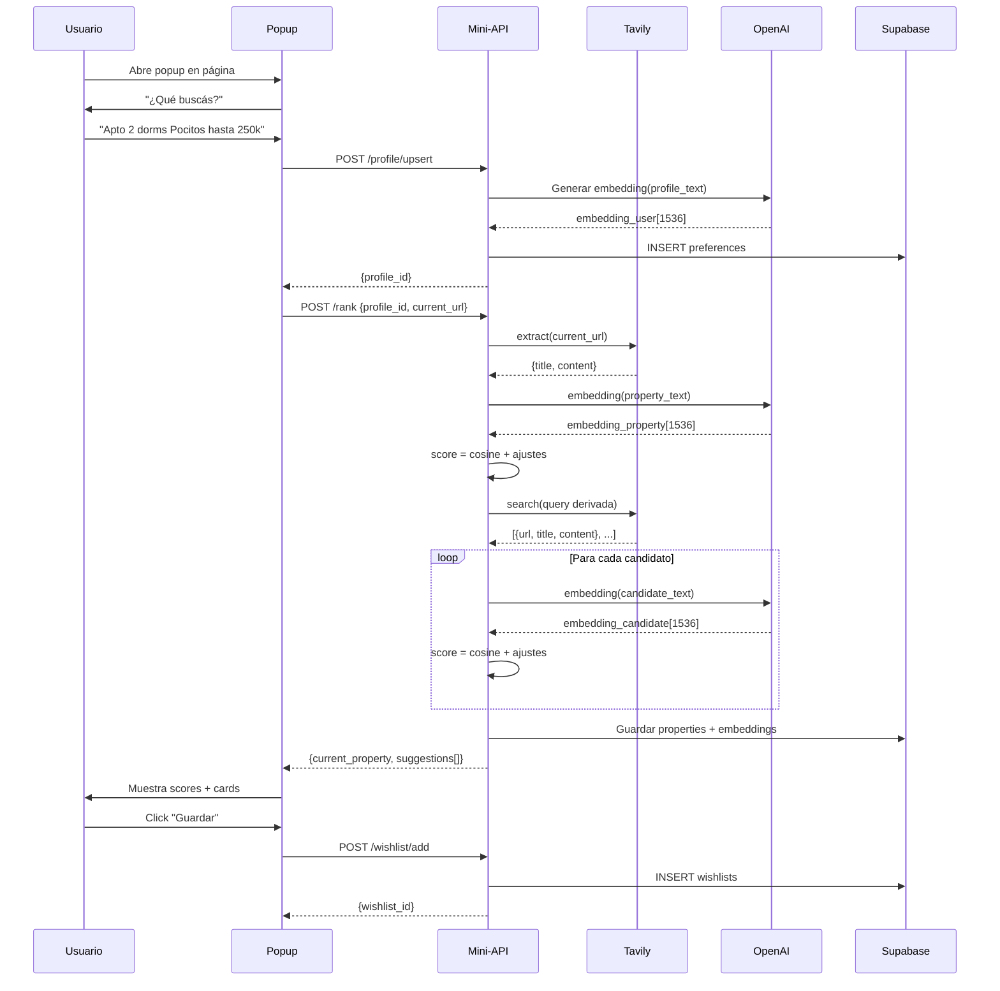

# MVP: Extensión Chrome + Mini-API para Búsqueda de Propiedades

> **Spec Técnica Completa v1.0**
> Público: Uruguay | Portales: MercadoLibre, InfoCasas, VeoCasas
> Stack: TypeScript, React, Tailwind, Supabase (Postgres+pgvector), OpenAI, Tavily

---

## Tabla de Contenidos

1. [Arquitectura](#1-arquitectura)
2. [Esquemas de Datos](#2-esquemas-de-datos)
3. [Contratos de API](#3-contratos-de-api)
4. [Lógica de Similitud](#4-lógica-de-similitud)
5. [Prompt del Agente](#5-prompt-del-agente)
6. [Estrategia Tavily](#6-estrategia-tavily)
7. [Código TypeScript](#7-código-typescript)
8. [Casos Borde](#8-casos-borde-y-manejo-de-errores)
9. [Variables de Entorno](#9-variables-de-entorno)
10. [Ejemplos Completos](#10-ejemplos-completos)

---

## 1. Arquitectura

### 1.1 Diagrama de Componentes

```
┌─────────────────────────────────────────────────────────────┐
│                     USUARIO (Uruguay)                        │
└─────────────────┬───────────────────────────────────────────┘
                  │
       ┌──────────▼──────────┐
       │  Chrome Extension   │
       │  (Manifest V3)      │
       │  ┌───────────────┐  │
       │  │ Popup (React) │  │
       │  │ + Tailwind    │  │
       │  └───────┬───────┘  │
       │  ┌───────┴───────┐  │
       │  │ Service Worker│  │
       │  └───────────────┘  │
       └──────────┼──────────┘
                  │ HTTPS
       ┌──────────▼──────────┐
       │    Mini-API (TS)    │
       │  ┌──────────────┐   │
       │  │ Express.js   │   │
       │  │ + TypeScript │   │
       │  └──────┬───────┘   │
       │  Routes:            │
       │  • POST /profile    │
       │  • POST /rank       │
       │  • POST /wishlist   │
       │  • GET  /wishlist   │
       └─────────┼───────────┘
                 │
     ┌───────────┼───────────┐
     │           │           │
┌────▼────┐ ┌───▼────┐ ┌───▼────┐
│ Tavily  │ │OpenAI  │ │Supabase│
│   API   │ │  API   │ │Postgres│
│         │ │(embed) │ │+pgvector│
└─────────┘ └────────┘ └────────┘
     │
     └─── Descubre URLs en:
          • mercadolibre.com.uy
          • infocasas.com.uy
          • veocasas.com.uy
```

### 1.2 Flujo de Datos



### 1.3 Arquitectura de Archivos

```
proyecto/
├── extension/
│   ├── manifest.json           # Manifest V3
│   ├── popup/
│   │   ├── index.html
│   │   ├── Popup.tsx          # Componente principal React
│   │   ├── index.tsx          # Entry point
│   │   └── styles.css         # Tailwind
│   ├── background/
│   │   └── service-worker.ts  # Service Worker
│   └── utils/
│       └── api.ts             # Cliente HTTP
│
├── api/
│   ├── src/
│   │   ├── index.ts           # Express app
│   │   ├── routes/
│   │   │   ├── profile.ts     # /profile/*
│   │   │   ├── rank.ts        # /rank
│   │   │   └── wishlist.ts    # /wishlist/*
│   │   ├── services/
│   │   │   ├── tavily.ts      # Cliente Tavily
│   │   │   ├── embeddings.ts  # OpenAI embeddings
│   │   │   ├── parser.ts      # Normalización
│   │   │   └── scorer.ts      # Lógica de score
│   │   ├── db/
│   │   │   ├── supabase.ts    # Cliente Supabase
│   │   │   └── queries.ts     # Queries SQL
│   │   └── types/
│   │       └── index.ts       # Tipos TS
│   ├── package.json
│   └── tsconfig.json
│
├── database/
│   ├── schema.sql             # DDL completo
│   └── seed.sql               # Datos de prueba
│
├── docs/
│   └── MVP_SPEC.md            # Este documento
│
└── .env.example
```

---

## 2. Esquemas de Datos

### 2.1 DDL (Postgres + pgvector)

```sql
-- Habilitar extensión pgvector
CREATE EXTENSION IF NOT EXISTS vector;

-- ========================================
-- TABLA: properties
-- ========================================
CREATE TABLE properties (
  id UUID PRIMARY KEY DEFAULT gen_random_uuid(),
  source TEXT NOT NULL CHECK (source IN ('ml', 'infocasas', 'veocasas')),
  url TEXT NOT NULL UNIQUE,
  title TEXT,
  price_usd NUMERIC(10, 2),
  location_city TEXT,
  location_area TEXT,
  bedrooms INT,
  bathrooms INT,
  covered_m2 NUMERIC(8, 2),
  total_m2 NUMERIC(8, 2),
  amenities TEXT[] DEFAULT '{}',
  images TEXT[] DEFAULT '{}',
  extracted_text TEXT,
  created_at TIMESTAMPTZ DEFAULT NOW(),
  updated_at TIMESTAMPTZ DEFAULT NOW()
);

CREATE INDEX idx_properties_url ON properties(url);
CREATE INDEX idx_properties_source ON properties(source);
CREATE INDEX idx_properties_location_area ON properties(location_area);
CREATE INDEX idx_properties_price ON properties(price_usd);

COMMENT ON TABLE properties IS 'Propiedades extraídas de portales';
COMMENT ON COLUMN properties.source IS 'Portal de origen: ml, infocasas, veocasas';
COMMENT ON COLUMN properties.extracted_text IS 'Texto completo extraído por Tavily';

-- ========================================
-- TABLA: embeddings
-- ========================================
CREATE TABLE embeddings (
  id UUID PRIMARY KEY DEFAULT gen_random_uuid(),
  property_id UUID NOT NULL REFERENCES properties(id) ON DELETE CASCADE,
  embedding vector(1536) NOT NULL,
  created_at TIMESTAMPTZ DEFAULT NOW(),
  UNIQUE(property_id)
);

CREATE INDEX idx_embeddings_property ON embeddings(property_id);

-- Índice HNSW para búsqueda vectorial rápida (opcional, para escalabilidad)
-- CREATE INDEX idx_embeddings_vector ON embeddings USING hnsw (embedding vector_cosine_ops);

COMMENT ON TABLE embeddings IS 'Embeddings de propiedades (OpenAI text-embedding-3-small)';

-- ========================================
-- TABLA: preferences
-- ========================================
CREATE TABLE preferences (
  id UUID PRIMARY KEY DEFAULT gen_random_uuid(),
  user_id TEXT NOT NULL UNIQUE,
  budget_min NUMERIC(10, 2),
  budget_max NUMERIC(10, 2),
  city TEXT,
  areas TEXT[] DEFAULT '{}',
  bedrooms_min INT,
  bathrooms_min INT,
  m2_min NUMERIC(8, 2),
  amenities TEXT[] DEFAULT '{}',
  profile_text TEXT NOT NULL,
  embedding vector(1536) NOT NULL,
  created_at TIMESTAMPTZ DEFAULT NOW(),
  updated_at TIMESTAMPTZ DEFAULT NOW()
);

CREATE INDEX idx_preferences_user ON preferences(user_id);

COMMENT ON TABLE preferences IS 'Perfiles de búsqueda de usuarios';
COMMENT ON COLUMN preferences.profile_text IS 'Texto libre del usuario + filtros normalizados';

-- ========================================
-- TABLA: wishlists
-- ========================================
CREATE TABLE wishlists (
  id UUID PRIMARY KEY DEFAULT gen_random_uuid(),
  user_id TEXT NOT NULL,
  property_id UUID NOT NULL REFERENCES properties(id) ON DELETE CASCADE,
  notes TEXT,
  created_at TIMESTAMPTZ DEFAULT NOW(),
  UNIQUE(user_id, property_id)
);

CREATE INDEX idx_wishlists_user ON wishlists(user_id);
CREATE INDEX idx_wishlists_property ON wishlists(property_id);

COMMENT ON TABLE wishlists IS 'Favoritos de usuarios';

-- ========================================
-- TABLA: tavily_cache
-- ========================================
CREATE TABLE tavily_cache (
  url TEXT PRIMARY KEY,
  response JSONB NOT NULL,
  expires_at TIMESTAMPTZ NOT NULL
);

CREATE INDEX idx_tavily_expires ON tavily_cache(expires_at);

COMMENT ON TABLE tavily_cache IS 'Cache de respuestas de Tavily (TTL 24h)';

-- ========================================
-- TRIGGER: updated_at automático
-- ========================================
CREATE OR REPLACE FUNCTION update_updated_at_column()
RETURNS TRIGGER AS $$
BEGIN
  NEW.updated_at = NOW();
  RETURN NEW;
END;
$$ LANGUAGE plpgsql;

CREATE TRIGGER update_properties_updated_at
  BEFORE UPDATE ON properties
  FOR EACH ROW
  EXECUTE FUNCTION update_updated_at_column();

CREATE TRIGGER update_preferences_updated_at
  BEFORE UPDATE ON preferences
  FOR EACH ROW
  EXECUTE FUNCTION update_updated_at_column();
```

### 2.2 JSON Schemas

#### 2.2.1 Filtros del Usuario (Input)

```json
{
  "$schema": "http://json-schema.org/draft-07/schema#",
  "type": "object",
  "properties": {
    "city": {
      "type": "string",
      "description": "Ciudad de búsqueda",
      "example": "Montevideo"
    },
    "areas": {
      "type": "array",
      "items": { "type": "string" },
      "description": "Barrios/zonas preferidas",
      "example": ["Pocitos", "Punta Carretas", "Carrasco"]
    },
    "budget_min": {
      "type": "number",
      "minimum": 0,
      "description": "Presupuesto mínimo en USD",
      "example": 150000
    },
    "budget_max": {
      "type": "number",
      "minimum": 0,
      "description": "Presupuesto máximo en USD",
      "example": 250000
    },
    "bedrooms_min": {
      "type": "integer",
      "minimum": 0,
      "description": "Mínimo de dormitorios",
      "example": 2
    },
    "bathrooms_min": {
      "type": "integer",
      "minimum": 0,
      "description": "Mínimo de baños",
      "example": 1
    },
    "m2_min": {
      "type": "number",
      "minimum": 0,
      "description": "Mínimo m² cubiertos",
      "example": 60
    },
    "amenities": {
      "type": "array",
      "items": {
        "type": "string",
        "enum": ["barbacoa", "garaje", "balcón", "piscina", "gimnasio"]
      },
      "description": "Amenidades deseadas",
      "example": ["barbacoa", "garaje"]
    }
  }
}
```

#### 2.2.2 Respuesta del Agente (Popup)

```json
{
  "$schema": "http://json-schema.org/draft-07/schema#",
  "type": "object",
  "required": ["copy_breve", "filtros", "faltantes_prioritarios"],
  "properties": {
    "copy_breve": {
      "type": "string",
      "maxLength": 150,
      "description": "Resumen de la búsqueda (<=25 palabras)",
      "example": "Busco apto 2 dorms en Pocitos, hasta USD 250k"
    },
    "filtros": {
      "type": "object",
      "properties": {
        "city": { "type": ["string", "null"] },
        "areas": { "type": "array", "items": { "type": "string" } },
        "budget_min": { "type": "number", "minimum": 0 },
        "budget_max": { "type": "number", "minimum": 0 },
        "bedrooms_min": { "type": "integer", "minimum": 0 },
        "bathrooms_min": { "type": "integer", "minimum": 0 },
        "m2_min": { "type": "number", "minimum": 0 },
        "amenities": { "type": "array", "items": { "type": "string" } }
      }
    },
    "faltantes_prioritarios": {
      "type": "array",
      "items": {
        "type": "string",
        "enum": ["city", "areas", "budget_max"]
      },
      "description": "Campos críticos que faltan. Vacío si tenés todo.",
      "example": []
    }
  }
}
```

#### 2.2.3 Property (Base)

```json
{
  "$schema": "http://json-schema.org/draft-07/schema#",
  "type": "object",
  "properties": {
    "id": { "type": "string", "format": "uuid" },
    "source": { "type": "string", "enum": ["ml", "infocasas", "veocasas"] },
    "url": { "type": "string", "format": "uri" },
    "title": { "type": ["string", "null"] },
    "price_usd": { "type": ["number", "null"] },
    "location_city": { "type": ["string", "null"] },
    "location_area": { "type": ["string", "null"] },
    "bedrooms": { "type": ["integer", "null"] },
    "bathrooms": { "type": ["integer", "null"] },
    "covered_m2": { "type": ["number", "null"] },
    "total_m2": { "type": ["number", "null"] },
    "amenities": { "type": "array", "items": { "type": "string" } },
    "images": { "type": "array", "items": { "type": "string", "format": "uri" } },
    "extracted_text": { "type": ["string", "null"] }
  }
}
```

---

## 3. Contratos de API

### 3.1 `POST /profile/upsert`

Crea o actualiza el perfil de búsqueda del usuario.

#### Request

```http
POST /profile/upsert
Content-Type: application/json

{
  "user_id": "user_12345",
  "profile_text": "Busco apartamento 2 dormitorios en Pocitos, hasta USD 250.000",
  "filtros": {
    "city": "Montevideo",
    "areas": ["Pocitos"],
    "budget_min": 150000,
    "budget_max": 250000,
    "bedrooms_min": 2,
    "bathrooms_min": 1,
    "m2_min": 60,
    "amenities": ["barbacoa", "garaje"]
  }
}
```

#### Response (200 OK)

```json
{
  "profile_id": "550e8400-e29b-41d4-a716-446655440000",
  "embedding_generated": true
}
```

#### Errores

- **400 Bad Request**: Falta `user_id` o `profile_text`
- **500 Internal Server Error**: Error al generar embedding o guardar en DB

---

### 3.2 `POST /rank`

Calcula score de propiedad actual + lista de sugerencias ordenadas.

#### Request

```http
POST /rank
Content-Type: application/json

{
  "profile_id": "550e8400-e29b-41d4-a716-446655440000",
  "current_url": "https://www.mercadolibre.com.uy/inmuebles/apartamento-en-venta-pocitos-2-dormitorios-MLU123456",
  "limit": 10
}
```

| Campo | Tipo | Requerido | Descripción |
|-------|------|-----------|-------------|
| `profile_id` | UUID | Sí | ID del perfil del usuario |
| `current_url` | string | No | URL de la propiedad actual (si aplica) |
| `limit` | number | No | Cantidad de sugerencias (default: 10, max: 50) |

#### Response (200 OK)

```json
{
  "current_property": {
    "url": "https://www.mercadolibre.com.uy/inmuebles/apartamento-en-venta-pocitos-2-dormitorios-MLU123456",
    "score": 0.87,
    "reasons": [
      "Precio dentro de rango (USD 235.000)",
      "Barrio coincide: Pocitos",
      "2 dormitorios (cumple mínimo)",
      "65 m² cubiertos (cumple mínimo)"
    ]
  },
  "suggestions": [
    {
      "source": "infocasas",
      "url": "https://www.infocasas.com.uy/venta/apartamento/montevideo/pocitos/12345",
      "title": "Apartamento 2 dormitorios con garaje - Pocitos",
      "price_usd": 220000,
      "location_area": "Pocitos",
      "bedrooms": 2,
      "bathrooms": 2,
      "covered_m2": 70,
      "score": 0.91,
      "reasons": [
        "Precio dentro de rango (USD 220.000)",
        "Barrio coincide: Pocitos",
        "2 dormitorios (cumple mínimo)",
        "Incluye garaje (amenidad solicitada)",
        "70 m² cubiertos (supera mínimo)"
      ]
    }
  ]
}
```

#### Errores

- **404 Not Found**: `profile_id` no existe
- **400 Bad Request**: `current_url` inválida o `limit` fuera de rango
- **500 Internal Server Error**: Error en Tavily, OpenAI o DB

---

### 3.3 `POST /wishlist/add`

Agrega una propiedad a la wishlist del usuario.

#### Request

```http
POST /wishlist/add
Content-Type: application/json

{
  "user_id": "user_12345",
  "property_url": "https://www.infocasas.com.uy/venta/apartamento/montevideo/pocitos/12345",
  "notes": "Me gusta el balcón y la ubicación"
}
```

#### Response (200 OK)

```json
{
  "wishlist_id": "660e8400-e29b-41d4-a716-446655440111",
  "property_id": "770e8400-e29b-41d4-a716-446655440222",
  "added_at": "2025-10-18T14:32:00Z"
}
```

#### Proceso Interno

1. Buscar `property` por `url` en DB
2. Si no existe:
   - Extraer metadata con Tavily
   - Generar embedding
   - Insertar en `properties` + `embeddings`
3. Insertar en `wishlists` (upsert para evitar duplicados)

#### Errores

- **400 Bad Request**: Falta `user_id` o `property_url`
- **500 Internal Server Error**: Error al extraer o guardar

---

### 3.4 `GET /wishlist`

Obtiene la wishlist del usuario.

#### Request

```http
GET /wishlist?user_id=user_12345
```

#### Response (200 OK)

```json
{
  "items": [
    {
      "wishlist_id": "660e8400-e29b-41d4-a716-446655440111",
      "property": {
        "id": "770e8400-e29b-41d4-a716-446655440222",
        "source": "infocasas",
        "url": "https://www.infocasas.com.uy/venta/apartamento/montevideo/pocitos/12345",
        "title": "Apartamento 2 dormitorios con garaje - Pocitos",
        "price_usd": 220000,
        "location_area": "Pocitos",
        "bedrooms": 2,
        "bathrooms": 2,
        "covered_m2": 70,
        "images": ["https://cdn.infocasas.com.uy/img1.jpg"]
      },
      "notes": "Me gusta el balcón y la ubicación",
      "added_at": "2025-10-18T14:32:00Z"
    }
  ],
  "total": 1
}
```

#### Errores

- **400 Bad Request**: Falta `user_id`

---

## 4. Lógica de Similitud

### 4.1 Fórmula Exacta

```
# 1. Score base (similitud coseno)
score_base = cosine(embedding_user, embedding_property)

# 2. Ajustes multiplicativos

## Precio
if (price_usd < budget_min * 0.85 OR price_usd > budget_max * 1.15):
  score_base *= 0.90

## Dormitorios
if (bedrooms < bedrooms_min):
  score_base *= 0.85

## Zona
if (location_area NOT IN areas):
  score_base *= 0.90

## m² cubiertos
if (covered_m2 < m2_min):
  score_base *= 0.88

## Amenidades (bonus)
amenities_match_count = count(amenities ∩ user_amenities)
if (amenities_match_count > 0):
  score_base *= (1 + 0.03 * amenities_match_count)  # max +9% por 3 amenidades

# 3. Score final (cap a 1.0)
score_final = min(score_base, 1.0)
```

### 4.2 Pseudocódigo Detallado

```typescript
function calculateScore(
  embeddingUser: number[],      // vector[1536]
  embeddingProperty: number[],   // vector[1536]
  property: Property,
  filters: Filters
): { score: number; reasons: string[] } {

  // 1. Score base
  let score = cosine(embeddingUser, embeddingProperty);
  const reasons: string[] = [];

  // 2. Ajuste por precio
  if (property.price_usd !== null && filters.budget_max > 0) {
    const priceMin = (filters.budget_min || 0) * 0.85;
    const priceMax = filters.budget_max * 1.15;

    if (property.price_usd >= priceMin && property.price_usd <= priceMax) {
      reasons.push(
        `Precio dentro de rango (USD ${property.price_usd.toLocaleString()})`
      );
    } else {
      score *= 0.90;

      const refPrice = property.price_usd > priceMax
        ? filters.budget_max
        : (filters.budget_min || priceMax);
      const diff = Math.round((property.price_usd / refPrice - 1) * 100);
      const sign = diff > 0 ? '+' : '';

      reasons.push(
        `Precio fuera de rango (USD ${property.price_usd.toLocaleString()}, ${sign}${diff}%)`
      );
    }
  }

  // 3. Ajuste por dormitorios
  if (property.bedrooms !== null && filters.bedrooms_min > 0) {
    if (property.bedrooms >= filters.bedrooms_min) {
      const verb = property.bedrooms > filters.bedrooms_min ? 'supera' : 'cumple';
      reasons.push(`${property.bedrooms} dormitorios (${verb} mínimo)`);
    } else {
      score *= 0.85;
      reasons.push(`${property.bedrooms} dormitorios (menos del mínimo)`);
    }
  }

  // 4. Ajuste por zona
  if (property.location_area && filters.areas.length > 0) {
    if (filters.areas.includes(property.location_area)) {
      reasons.push(`Barrio coincide: ${property.location_area}`);
    } else {
      score *= 0.90;
      reasons.push(`Barrio alternativo: ${property.location_area}`);
    }
  }

  // 5. Ajuste por m²
  if (property.covered_m2 !== null && filters.m2_min > 0) {
    if (property.covered_m2 >= filters.m2_min) {
      const verb = property.covered_m2 > filters.m2_min * 1.2 ? 'supera' : 'cumple';
      reasons.push(`${property.covered_m2} m² cubiertos (${verb} mínimo)`);
    } else {
      score *= 0.88;
      reasons.push(`${property.covered_m2} m² cubiertos (menos del mínimo)`);
    }
  }

  // 6. Bonus por amenidades
  if (property.amenities.length > 0 && filters.amenities.length > 0) {
    const matched = property.amenities.filter(a =>
      filters.amenities.includes(a)
    );

    if (matched.length > 0) {
      score *= (1 + 0.03 * matched.length);

      const plural = matched.length > 1;
      const amenitiesStr = matched.join(', ');
      reasons.push(
        `Incluye ${amenitiesStr} (amenidad${plural ? 'es' : ''} solicitada${plural ? 's' : ''})`
      );
    }
  }

  // 7. Cap a 1.0
  return {
    score: Math.min(score, 1.0),
    reasons
  };
}
```

### 4.3 Función Coseno

```typescript
function cosine(a: number[], b: number[]): number {
  if (a.length !== b.length) {
    throw new Error(`Vectors must have same length (got ${a.length} and ${b.length})`);
  }

  let dotProduct = 0;
  let normA = 0;
  let normB = 0;

  for (let i = 0; i < a.length; i++) {
    dotProduct += a[i] * b[i];
    normA += a[i] * a[i];
    normB += b[i] * b[i];
  }

  const denominator = Math.sqrt(normA) * Math.sqrt(normB);

  if (denominator === 0) {
    return 0;  // Evitar división por cero
  }

  return dotProduct / denominator;
}
```

---

## 5. Prompt del Agente

### 5.1 Prompt de Sistema

```markdown
Sos un asistente de búsqueda de propiedades en Uruguay. Tu trabajo es entender qué busca el usuario con la MENOR fricción posible.

## REGLAS ESTRICTAS

1. **Saludá corto** (max 10 palabras) y pedí lo esencial en UNA sola pregunta si falta algo.
2. Los campos **críticos** son:
   - Ciudad
   - Barrio(s) o zona(s)
   - Presupuesto máximo
3. Si el usuario ya dio suficiente info, **NO repreguntés**.
4. **SIEMPRE devolvé JSON válido** con esta estructura exacta:

```json
{
  "copy_breve": "string de máx 25 palabras resumiendo la búsqueda",
  "filtros": {
    "city": "string o null",
    "areas": ["array de barrios o vacío"],
    "budget_min": 0,
    "budget_max": 0,
    "bedrooms_min": 0,
    "bathrooms_min": 0,
    "m2_min": 0,
    "amenities": ["array o vacío"]
  },
  "faltantes_prioritarios": ["city" | "budget_max" | "areas"]  // vacío si tenés todo
}
```

## NORMALIZACIÓN DE AMENIDADES

Mapear texto del usuario a estas categorías:

| Usuario dice | Normalizar a |
|-------------|-------------|
| garaje, cochera, parking, estacionamiento | `"garaje"` |
| barbacoa, parrillero, parrilla | `"barbacoa"` |
| balcón, terraza, deck | `"balcón"` |
| piscina, pileta | `"piscina"` |
| gimnasio, gym | `"gimnasio"` |

## NORMALIZACIÓN DE BARRIOS (Montevideo)

Reconocer y mapear:

- Pocitos
- Punta Carretas
- Carrasco (incluir "Carrasco Norte")
- Buceo
- Parque Rodó
- Centro
- Cordón
- Tres Cruces
- Malvín
- Ciudad Vieja
- Punta Gorda

Si el usuario menciona barrio no reconocido, incluirlo igual en `areas[]`.

## EXTRACCIÓN DE PRESUPUESTO

Patrones comunes:

- "hasta 250k" → `budget_max: 250000`
- "hasta 250 mil" → `budget_max: 250000`
- "entre 150 y 250" → `budget_min: 150000, budget_max: 250000`
- "máximo USD 300.000" → `budget_max: 300000`
- "200k - 300k" → `budget_min: 200000, budget_max: 300000`

## EXTRACCIÓN DE DORMITORIOS

- "2 dormitorios" → `bedrooms_min: 2`
- "mínimo 3 dorms" → `bedrooms_min: 3`
- "1 o 2 dorms" → `bedrooms_min: 1`

## TONALIDAD

Español rioplatense, directo, amigable pero breve. Ejemplos:

- ✅ "¡Hola! ¿En qué zona buscás y hasta cuánto?"
- ✅ "Perfecto. ¿Cuál es tu presupuesto máximo?"
- ❌ "¡Hola! Me encantaría ayudarte a encontrar la propiedad perfecta para vos. Para poder ofrecerte las mejores opciones, necesito que me cuentes..."

## REPREGUNTA (SOLO SI FALTA ALGO CRÍTICO)

Si `faltantes_prioritarios` no está vacío, preguntar así:

- Falta `city`: "¿En qué ciudad estás buscando?"
- Falta `budget_max`: "¿Cuál es tu presupuesto máximo?"
- Falta `areas`: "¿En qué zona/barrio preferís?"
- Faltan 2 o más: "¿En qué zona buscás y cuál es tu presupuesto máximo?"

**IMPORTANTE**: Solo **1 repregunta** por turno. No hacer más de 2 turnos totales.
```

### 5.2 Ejemplos de Conversación

#### Ejemplo 1: Usuario da info completa

```
Turno 1:
Usuario: "Hola, estoy buscando un apartamento en Pocitos, 2 dormitorios, hasta 250 mil dólares. Me gustaría que tenga garaje."

Agente: "Perfecto, busco apto 2 dorms en Pocitos hasta USD 250k con garaje."

JSON generado:
{
  "copy_breve": "Apto 2 dorms Pocitos hasta USD 250k con garaje",
  "filtros": {
    "city": "Montevideo",
    "areas": ["Pocitos"],
    "budget_min": 0,
    "budget_max": 250000,
    "bedrooms_min": 2,
    "bathrooms_min": 0,
    "m2_min": 0,
    "amenities": ["garaje"]
  },
  "faltantes_prioritarios": []
}

[Popup procede a llamar /rank]
```

#### Ejemplo 2: Falta presupuesto

```
Turno 1:
Usuario: "Busco apartamento 2 dormitorios en Pocitos o Punta Carretas"

Agente: "¡Dale! ¿Cuál es tu presupuesto máximo?"

JSON generado:
{
  "copy_breve": "Apto 2 dorms Pocitos/Punta Carretas",
  "filtros": {
    "city": "Montevideo",
    "areas": ["Pocitos", "Punta Carretas"],
    "budget_min": 0,
    "budget_max": 0,
    "bedrooms_min": 2,
    "bathrooms_min": 0,
    "m2_min": 0,
    "amenities": []
  },
  "faltantes_prioritarios": ["budget_max"]
}

Turno 2:
Usuario: "Hasta 300 mil"

Agente: "Perfecto, busco apto 2 dorms Pocitos/Punta Carretas hasta USD 300k."

JSON generado:
{
  "copy_breve": "Apto 2 dorms Pocitos/Punta Carretas hasta USD 300k",
  "filtros": {
    "city": "Montevideo",
    "areas": ["Pocitos", "Punta Carretas"],
    "budget_min": 0,
    "budget_max": 300000,
    "bedrooms_min": 2,
    "bathrooms_min": 0,
    "m2_min": 0,
    "amenities": []
  },
  "faltantes_prioritarios": []
}

[Popup procede a llamar /rank]
```

#### Ejemplo 3: Falta zona y presupuesto

```
Turno 1:
Usuario: "Hola, estoy buscando un apartamento en Montevideo"

Agente: "¡Hola! ¿En qué zona buscás y cuál es tu presupuesto máximo?"

JSON generado:
{
  "copy_breve": "Apartamento en Montevideo",
  "filtros": {
    "city": "Montevideo",
    "areas": [],
    "budget_min": 0,
    "budget_max": 0,
    "bedrooms_min": 0,
    "bathrooms_min": 0,
    "m2_min": 0,
    "amenities": []
  },
  "faltantes_prioritarios": ["areas", "budget_max"]
}

Turno 2:
Usuario: "Pocitos, hasta 200k"

Agente: "Perfecto, busco apto en Pocitos hasta USD 200k."

JSON generado:
{
  "copy_breve": "Apto Pocitos hasta USD 200k",
  "filtros": {
    "city": "Montevideo",
    "areas": ["Pocitos"],
    "budget_min": 0,
    "budget_max": 200000,
    "bedrooms_min": 0,
    "bathrooms_min": 0,
    "m2_min": 0,
    "amenities": []
  },
  "faltantes_prioritarios": []
}

[Popup procede a llamar /rank]
```

---

## 6. Estrategia Tavily

### 6.1 Uso de Tavily Search

#### Para descubrir candidatos

```typescript
import axios from 'axios';

const TAVILY_API_KEY = process.env.TAVILY_API_KEY!;
const TAVILY_BASE_URL = 'https://api.tavily.com';

interface TavilySearchParams {
  query: string;
  include_domains?: string[];
  max_results?: number;
  search_depth?: 'basic' | 'advanced';
  include_raw_content?: boolean;
}

interface TavilySearchResult {
  title: string;
  url: string;
  content: string;  // Extracto resumido
  score: number;    // Relevancia de Tavily (0-1)
}

async function tavilySearch(params: TavilySearchParams): Promise<TavilySearchResult[]> {
  const response = await axios.post(`${TAVILY_BASE_URL}/search`, {
    api_key: TAVILY_API_KEY,
    query: params.query,
    include_domains: params.include_domains || [],
    max_results: params.max_results || 10,
    search_depth: params.search_depth || 'basic',
    include_raw_content: params.include_raw_content || false
  });

  return response.data.results || [];
}
```

#### Construcción de query

```typescript
function buildSearchQuery(filters: Filters): string {
  const parts: string[] = [];

  // Tipo de propiedad (por ahora hardcodeado)
  parts.push('apartamento');

  // Dormitorios
  if (filters.bedrooms_min > 0) {
    parts.push(`${filters.bedrooms_min} dormitorios`);
  }

  // Zona
  if (filters.areas && filters.areas.length > 0) {
    // Unir con OR para buscar en múltiples barrios
    parts.push(`(${filters.areas.join(' OR ')})`);
  } else if (filters.city) {
    parts.push(filters.city);
  }

  // Amenidades clave
  if (filters.amenities.includes('garaje')) {
    parts.push('garaje');
  }

  return parts.join(' ');
}

// Ejemplo de uso:
const filters = {
  city: 'Montevideo',
  areas: ['Pocitos', 'Punta Carretas'],
  bedrooms_min: 2,
  amenities: ['garaje']
};

const query = buildSearchQuery(filters);
// → "apartamento 2 dormitorios (Pocitos OR Punta Carretas) garaje"

const results = await tavilySearch({
  query,
  include_domains: [
    'mercadolibre.com.uy',
    'infocasas.com.uy',
    'veocasas.com.uy'
  ],
  max_results: 30,
  search_depth: 'basic'
});
```

### 6.2 Uso de Tavily Extract

Para extraer metadata de una URL específica (current_url):

```typescript
async function tavilyExtract(urls: string[]): Promise<Record<string, string>> {
  const response = await axios.post(`${TAVILY_BASE_URL}/extract`, {
    api_key: TAVILY_API_KEY,
    urls
  });

  return response.data.results || {};
}

// Ejemplo:
const extracted = await tavilyExtract([
  'https://www.mercadolibre.com.uy/inmuebles/apartamento-pocitos-MLU123'
]);

// extracted = {
//   'https://www.mercadolibre.com.uy/inmuebles/apartamento-pocitos-MLU123':
//     'Apartamento 2 dormitorios en Pocitos. USD 235.000. 65 m²...'
// }
```

### 6.3 Parsing Ligero desde Extracto

```typescript
const HARDCODED_RATE = 40;  // UYU/USD

interface ParsedMetadata {
  url: string;
  source: 'ml' | 'infocasas' | 'veocasas';
  title?: string;
  price_usd?: number;
  location_area?: string;
  bedrooms?: number;
  bathrooms?: number;
  covered_m2?: number;
  amenities: string[];
  extracted_text: string;
}

function extractMetadataFromTavilyContent(
  content: string,
  url: string
): ParsedMetadata {

  const metadata: ParsedMetadata = {
    url,
    source: detectSource(url),
    amenities: [],
    extracted_text: content
  };

  // ===== PRECIO =====
  // Intentar USD/U$S primero
  const priceUsdMatch = content.match(/(?:USD?|U\$S)\s*([\d.,]+)/i);
  if (priceUsdMatch) {
    const rawPrice = priceUsdMatch[1].replace(/[.,]/g, '');
    metadata.price_usd = parseFloat(rawPrice);
  } else {
    // Intentar UYU ($ solo)
    const priceUyuMatch = content.match(/\$\s*([\d.,]+)/);
    if (priceUyuMatch) {
      const rawPrice = priceUyuMatch[1].replace(/[.,]/g, '');
      const uyuPrice = parseFloat(rawPrice);

      // Convertir si parece ser monto grande (> 1M UYU)
      if (uyuPrice > 1000000) {
        metadata.price_usd = Math.round(uyuPrice / HARDCODED_RATE);
      }
    }
  }

  // ===== DORMITORIOS =====
  const bedsMatch = content.match(/(\d+)\s*dormitorios?/i);
  if (bedsMatch) {
    metadata.bedrooms = parseInt(bedsMatch[1]);
  }

  // ===== BAÑOS =====
  const bathsMatch = content.match(/(\d+)\s*baños?/i);
  if (bathsMatch) {
    metadata.bathrooms = parseInt(bathsMatch[1]);
  }

  // ===== m² =====
  const m2Match = content.match(/(\d+)\s*m[²2]/i);
  if (m2Match) {
    metadata.covered_m2 = parseFloat(m2Match[1]);
  }

  // ===== BARRIO/ZONA =====
  const knownAreas = [
    'Pocitos', 'Punta Carretas', 'Carrasco', 'Buceo',
    'Parque Rodó', 'Centro', 'Cordón', 'Tres Cruces',
    'Malvín', 'Ciudad Vieja', 'Punta Gorda', 'Carrasco Norte'
  ];

  for (const area of knownAreas) {
    if (content.includes(area)) {
      metadata.location_area = area;
      break;
    }
  }

  // ===== AMENIDADES =====
  const amenitiesMap = [
    { patterns: [/garaje/i, /cochera/i, /parking/i], value: 'garaje' },
    { patterns: [/barbacoa/i, /parrillero/i], value: 'barbacoa' },
    { patterns: [/balc[óo]n/i, /terraza/i], value: 'balcón' },
    { patterns: [/piscina/i, /pileta/i], value: 'piscina' },
    { patterns: [/gimnasio/i, /gym/i], value: 'gimnasio' }
  ];

  for (const { patterns, value } of amenitiesMap) {
    if (patterns.some(p => p.test(content))) {
      metadata.amenities.push(value);
    }
  }

  return metadata;
}

function detectSource(url: string): 'ml' | 'infocasas' | 'veocasas' {
  if (url.includes('mercadolibre')) return 'ml';
  if (url.includes('infocasas')) return 'infocasas';
  if (url.includes('veocasas')) return 'veocasas';
  return 'ml';  // default
}
```

### 6.4 Cache de Tavily (24h TTL)

```typescript
import { createClient } from '@supabase/supabase-js';

const supabase = createClient(
  process.env.SUPABASE_URL!,
  process.env.SUPABASE_ANON_KEY!
);

async function getCachedTavilyResult(url: string): Promise<any | null> {
  const { data, error } = await supabase
    .from('tavily_cache')
    .select('response')
    .eq('url', url)
    .gt('expires_at', new Date().toISOString())
    .single();

  if (error || !data) return null;
  return data.response;
}

async function setCachedTavilyResult(url: string, response: any): Promise<void> {
  const expiresAt = new Date(Date.now() + 24 * 60 * 60 * 1000);  // +24h

  await supabase.from('tavily_cache').upsert({
    url,
    response,
    expires_at: expiresAt.toISOString()
  });
}

// Uso:
async function fetchWithCache(url: string): Promise<string> {
  // 1. Intentar cache
  const cached = await getCachedTavilyResult(url);
  if (cached) return cached.content;

  // 2. Fetch desde Tavily
  const extracted = await tavilyExtract([url]);
  const content = extracted[url] || '';

  // 3. Guardar en cache
  await setCachedTavilyResult(url, { content });

  return content;
}
```

---

## 7. Código TypeScript

### 7.1 Cliente Tavily (`services/tavily.ts`)

```typescript
import axios from 'axios';

const TAVILY_API_KEY = process.env.TAVILY_API_KEY!;
const TAVILY_BASE_URL = 'https://api.tavily.com';

export interface TavilySearchParams {
  query: string;
  include_domains?: string[];
  max_results?: number;
  search_depth?: 'basic' | 'advanced';
  include_raw_content?: boolean;
}

export interface TavilySearchResult {
  title: string;
  url: string;
  content: string;
  score: number;
}

export async function tavilySearch(
  params: TavilySearchParams
): Promise<TavilySearchResult[]> {
  try {
    const response = await axios.post(`${TAVILY_BASE_URL}/search`, {
      api_key: TAVILY_API_KEY,
      query: params.query,
      include_domains: params.include_domains || [],
      max_results: params.max_results || 10,
      search_depth: params.search_depth || 'basic',
      include_raw_content: params.include_raw_content || false
    });

    return response.data.results || [];
  } catch (error: any) {
    console.error('Tavily search error:', error.response?.data || error.message);
    throw new Error('Failed to search with Tavily');
  }
}

export async function tavilyExtract(urls: string[]): Promise<Record<string, string>> {
  try {
    const response = await axios.post(`${TAVILY_BASE_URL}/extract`, {
      api_key: TAVILY_API_KEY,
      urls
    });

    return response.data.results || {};
  } catch (error: any) {
    console.error('Tavily extract error:', error.response?.data || error.message);
    throw new Error('Failed to extract with Tavily');
  }
}

export function buildSearchQuery(filters: any): string {
  const parts: string[] = [];

  parts.push('apartamento');

  if (filters.bedrooms_min > 0) {
    parts.push(`${filters.bedrooms_min} dormitorios`);
  }

  if (filters.areas && filters.areas.length > 0) {
    parts.push(`(${filters.areas.join(' OR ')})`);
  } else if (filters.city) {
    parts.push(filters.city);
  }

  if (filters.amenities?.includes('garaje')) {
    parts.push('garaje');
  }

  return parts.join(' ');
}
```

### 7.2 Embeddings OpenAI (`services/embeddings.ts`)

```typescript
import OpenAI from 'openai';

const openai = new OpenAI({
  apiKey: process.env.OPENAI_API_KEY!
});

const EMBEDDING_MODEL = 'text-embedding-3-small';
const EMBEDDING_DIMENSIONS = 1536;

export async function embedText(text: string): Promise<number[]> {
  try {
    const response = await openai.embeddings.create({
      model: EMBEDDING_MODEL,
      input: text,
      encoding_format: 'float'
    });

    return response.data[0].embedding;
  } catch (error: any) {
    console.error('OpenAI embedding error:', error.message);
    throw new Error('Failed to generate embedding');
  }
}

export function cosine(a: number[], b: number[]): number {
  if (a.length !== b.length) {
    throw new Error(`Vectors must have same length (got ${a.length} and ${b.length})`);
  }

  let dotProduct = 0;
  let normA = 0;
  let normB = 0;

  for (let i = 0; i < a.length; i++) {
    dotProduct += a[i] * b[i];
    normA += a[i] * a[i];
    normB += b[i] * b[i];
  }

  const denominator = Math.sqrt(normA) * Math.sqrt(normB);

  if (denominator === 0) {
    return 0;
  }

  return dotProduct / denominator;
}

export function buildPropertyText(property: any): string {
  const parts: string[] = [];

  if (property.title) parts.push(property.title);
  if (property.location_area) parts.push(`Barrio: ${property.location_area}`);
  if (property.location_city) parts.push(`Ciudad: ${property.location_city}`);
  if (property.bedrooms) parts.push(`${property.bedrooms} dormitorios`);
  if (property.bathrooms) parts.push(`${property.bathrooms} baños`);
  if (property.covered_m2) parts.push(`${property.covered_m2} m² cubiertos`);
  if (property.total_m2) parts.push(`${property.total_m2} m² totales`);
  if (property.amenities && property.amenities.length > 0) {
    parts.push(`Amenidades: ${property.amenities.join(', ')}`);
  }
  if (property.extracted_text) {
    // Limitar a primeros 500 chars para no hacer el embedding demasiado largo
    parts.push(property.extracted_text.substring(0, 500));
  }

  return parts.join('. ');
}

export function buildProfileText(filters: any, userText?: string): string {
  const parts: string[] = [];

  if (userText) parts.push(userText);
  if (filters.city) parts.push(`Ciudad: ${filters.city}`);
  if (filters.areas && filters.areas.length > 0) {
    parts.push(`Barrios: ${filters.areas.join(', ')}`);
  }
  if (filters.budget_max) parts.push(`Presupuesto hasta USD ${filters.budget_max}`);
  if (filters.budget_min) parts.push(`Presupuesto desde USD ${filters.budget_min}`);
  if (filters.bedrooms_min) parts.push(`Mínimo ${filters.bedrooms_min} dormitorios`);
  if (filters.bathrooms_min) parts.push(`Mínimo ${filters.bathrooms_min} baños`);
  if (filters.m2_min) parts.push(`Mínimo ${filters.m2_min} m²`);
  if (filters.amenities && filters.amenities.length > 0) {
    parts.push(`Amenidades: ${filters.amenities.join(', ')}`);
  }

  return parts.join('. ');
}
```

### 7.3 Parser (`services/parser.ts`)

```typescript
export const HARDCODED_RATE = 40;  // UYU/USD

export interface ParsedMetadata {
  url: string;
  source: 'ml' | 'infocasas' | 'veocasas';
  title?: string;
  price_usd?: number;
  location_city?: string;
  location_area?: string;
  bedrooms?: number;
  bathrooms?: number;
  covered_m2?: number;
  total_m2?: number;
  amenities: string[];
  images: string[];
  extracted_text: string;
}

export function extractMetadataFromTavilyContent(
  content: string,
  url: string,
  title?: string
): ParsedMetadata {

  const metadata: ParsedMetadata = {
    url,
    source: detectSource(url),
    title: title || undefined,
    location_city: 'Montevideo',  // Hardcoded por ahora
    amenities: [],
    images: [],
    extracted_text: content
  };

  // ===== PRECIO =====
  const priceUsdMatch = content.match(/(?:USD?|U\$S)\s*([\d.,]+)/i);
  if (priceUsdMatch) {
    const rawPrice = priceUsdMatch[1].replace(/[.,]/g, '');
    metadata.price_usd = parseFloat(rawPrice);
  } else {
    const priceUyuMatch = content.match(/\$\s*([\d.,]+)/);
    if (priceUyuMatch) {
      const rawPrice = priceUyuMatch[1].replace(/[.,]/g, '');
      const uyuPrice = parseFloat(rawPrice);

      if (uyuPrice > 1000000) {
        metadata.price_usd = Math.round(uyuPrice / HARDCODED_RATE);
      }
    }
  }

  // ===== DORMITORIOS =====
  const bedsMatch = content.match(/(\d+)\s*dormitorios?/i);
  if (bedsMatch) {
    metadata.bedrooms = parseInt(bedsMatch[1]);
  }

  // ===== BAÑOS =====
  const bathsMatch = content.match(/(\d+)\s*baños?/i);
  if (bathsMatch) {
    metadata.bathrooms = parseInt(bathsMatch[1]);
  }

  // ===== m² =====
  const m2Match = content.match(/(\d+)\s*m[²2]/i);
  if (m2Match) {
    metadata.covered_m2 = parseFloat(m2Match[1]);
  }

  // ===== BARRIO/ZONA =====
  const knownAreas = [
    'Pocitos', 'Punta Carretas', 'Carrasco', 'Buceo',
    'Parque Rodó', 'Centro', 'Cordón', 'Tres Cruces',
    'Malvín', 'Ciudad Vieja', 'Punta Gorda', 'Carrasco Norte'
  ];

  for (const area of knownAreas) {
    if (content.includes(area)) {
      metadata.location_area = area;
      break;
    }
  }

  // ===== AMENIDADES =====
  const amenitiesMap = [
    { patterns: [/garaje/i, /cochera/i, /parking/i], value: 'garaje' },
    { patterns: [/barbacoa/i, /parrillero/i], value: 'barbacoa' },
    { patterns: [/balc[óo]n/i, /terraza/i], value: 'balcón' },
    { patterns: [/piscina/i, /pileta/i], value: 'piscina' },
    { patterns: [/gimnasio/i, /gym/i], value: 'gimnasio' }
  ];

  for (const { patterns, value } of amenitiesMap) {
    if (patterns.some(p => p.test(content))) {
      metadata.amenities.push(value);
    }
  }

  return metadata;
}

export function detectSource(url: string): 'ml' | 'infocasas' | 'veocasas' {
  if (url.includes('mercadolibre')) return 'ml';
  if (url.includes('infocasas')) return 'infocasas';
  if (url.includes('veocasas')) return 'veocasas';
  return 'ml';
}
```

### 7.4 Scorer (`services/scorer.ts`)

```typescript
import { cosine } from './embeddings';

interface ScoreResult {
  score: number;
  reasons: string[];
}

export function calculateScore(
  embeddingUser: number[],
  embeddingProperty: number[],
  property: any,
  filters: any
): ScoreResult {

  let score = cosine(embeddingUser, embeddingProperty);
  const reasons: string[] = [];

  // ===== PRECIO =====
  if (property.price_usd !== null && property.price_usd !== undefined && filters.budget_max > 0) {
    const priceMin = (filters.budget_min || 0) * 0.85;
    const priceMax = filters.budget_max * 1.15;

    if (property.price_usd >= priceMin && property.price_usd <= priceMax) {
      reasons.push(
        `Precio dentro de rango (USD ${property.price_usd.toLocaleString()})`
      );
    } else {
      score *= 0.90;

      const refPrice = property.price_usd > priceMax
        ? filters.budget_max
        : (filters.budget_min || priceMax);
      const diff = Math.round((property.price_usd / refPrice - 1) * 100);
      const sign = diff > 0 ? '+' : '';

      reasons.push(
        `Precio fuera de rango (USD ${property.price_usd.toLocaleString()}, ${sign}${diff}%)`
      );
    }
  }

  // ===== DORMITORIOS =====
  if (property.bedrooms !== null && property.bedrooms !== undefined && filters.bedrooms_min > 0) {
    if (property.bedrooms >= filters.bedrooms_min) {
      const verb = property.bedrooms > filters.bedrooms_min ? 'supera' : 'cumple';
      reasons.push(`${property.bedrooms} dormitorios (${verb} mínimo)`);
    } else {
      score *= 0.85;
      reasons.push(`${property.bedrooms} dormitorios (menos del mínimo)`);
    }
  }

  // ===== ZONA =====
  if (property.location_area && filters.areas?.length > 0) {
    if (filters.areas.includes(property.location_area)) {
      reasons.push(`Barrio coincide: ${property.location_area}`);
    } else {
      score *= 0.90;
      reasons.push(`Barrio alternativo: ${property.location_area}`);
    }
  }

  // ===== m² =====
  if (property.covered_m2 !== null && property.covered_m2 !== undefined && filters.m2_min > 0) {
    if (property.covered_m2 >= filters.m2_min) {
      const verb = property.covered_m2 > filters.m2_min * 1.2 ? 'supera' : 'cumple';
      reasons.push(`${property.covered_m2} m² cubiertos (${verb} mínimo)`);
    } else {
      score *= 0.88;
      reasons.push(`${property.covered_m2} m² cubiertos (menos del mínimo)`);
    }
  }

  // ===== AMENIDADES (bonus) =====
  if (property.amenities?.length > 0 && filters.amenities?.length > 0) {
    const matched = property.amenities.filter((a: string) =>
      filters.amenities.includes(a)
    );

    if (matched.length > 0) {
      score *= (1 + 0.03 * matched.length);

      const plural = matched.length > 1;
      const amenitiesStr = matched.join(', ');
      reasons.push(
        `Incluye ${amenitiesStr} (amenidad${plural ? 'es' : ''} solicitada${plural ? 's' : ''})`
      );
    }
  }

  return {
    score: Math.min(score, 1.0),
    reasons
  };
}
```

### 7.5 Endpoint `/rank` (`routes/rank.ts`)

```typescript
import { Router, Request, Response } from 'express';
import { createClient } from '@supabase/supabase-js';
import { tavilySearch, tavilyExtract, buildSearchQuery } from '../services/tavily';
import { embedText, buildPropertyText } from '../services/embeddings';
import { extractMetadataFromTavilyContent } from '../services/parser';
import { calculateScore } from '../services/scorer';

const router = Router();
const supabase = createClient(
  process.env.SUPABASE_URL!,
  process.env.SUPABASE_ANON_KEY!
);

interface RankRequest {
  profile_id: string;
  current_url?: string;
  limit?: number;
}

router.post('/', async (req: Request, res: Response) => {
  try {
    const { profile_id, current_url, limit = 10 }: RankRequest = req.body;

    if (!profile_id) {
      return res.status(400).json({ error: 'profile_id is required' });
    }

    if (limit > 50) {
      return res.status(400).json({ error: 'limit must be <= 50' });
    }

    // 1. Obtener perfil
    const { data: profile, error: profileError } = await supabase
      .from('preferences')
      .select('*')
      .eq('id', profile_id)
      .single();

    if (profileError || !profile) {
      return res.status(404).json({ error: 'Profile not found' });
    }

    const embeddingUser = profile.embedding;
    const filters = {
      city: profile.city,
      areas: profile.areas || [],
      budget_min: profile.budget_min || 0,
      budget_max: profile.budget_max || 0,
      bedrooms_min: profile.bedrooms_min || 0,
      bathrooms_min: profile.bathrooms_min || 0,
      m2_min: profile.m2_min || 0,
      amenities: profile.amenities || []
    };

    let currentProperty = null;

    // 2. Procesar current_url si existe
    if (current_url) {
      try {
        // Revisar cache
        let content = await getCachedTavilyResult(current_url);

        if (!content) {
          const extracted = await tavilyExtract([current_url]);
          content = extracted[current_url] || '';
          await setCachedTavilyResult(current_url, { content });
        }

        const metadata = extractMetadataFromTavilyContent(content, current_url);
        const propertyText = buildPropertyText(metadata);
        const embeddingProperty = await embedText(propertyText);

        const { score, reasons } = calculateScore(
          embeddingUser,
          embeddingProperty,
          metadata,
          filters
        );

        currentProperty = {
          url: current_url,
          score: Math.round(score * 100) / 100,
          reasons
        };

        // Guardar en DB
        await upsertProperty(metadata, embeddingProperty);

      } catch (error) {
        console.error('Error processing current_url:', error);
        // Continuar sin current_property
      }
    }

    // 3. Buscar candidatos con Tavily
    const query = buildSearchQuery(filters);
    const tavilyResults = await tavilySearch({
      query,
      include_domains: [
        'mercadolibre.com.uy',
        'infocasas.com.uy',
        'veocasas.com.uy'
      ],
      max_results: 30
    });

    // 4. Procesar candidatos
    const candidates = [];
    const seenUrls = new Set<string>();

    for (const result of tavilyResults) {
      if (seenUrls.has(result.url)) continue;
      seenUrls.add(result.url);

      try {
        const metadata = extractMetadataFromTavilyContent(
          result.content,
          result.url,
          result.title
        );

        // Buscar embedding existente
        let embeddingProperty = await getPropertyEmbedding(result.url);

        if (!embeddingProperty) {
          const propertyText = buildPropertyText(metadata);
          embeddingProperty = await embedText(propertyText);
          await upsertProperty(metadata, embeddingProperty);
        }

        const { score, reasons } = calculateScore(
          embeddingUser,
          embeddingProperty,
          metadata,
          filters
        );

        candidates.push({
          source: metadata.source,
          url: result.url,
          title: metadata.title,
          price_usd: metadata.price_usd,
          location_area: metadata.location_area,
          bedrooms: metadata.bedrooms,
          bathrooms: metadata.bathrooms,
          covered_m2: metadata.covered_m2,
          score: Math.round(score * 100) / 100,
          reasons
        });

      } catch (error) {
        console.error(`Error processing ${result.url}:`, error);
        continue;
      }
    }

    // 5. Ordenar y limitar
    candidates.sort((a, b) => b.score - a.score);
    const suggestions = candidates.slice(0, limit);

    res.json({
      current_property: currentProperty,
      suggestions
    });

  } catch (error: any) {
    console.error('Rank error:', error);
    res.status(500).json({ error: error.message || 'Internal server error' });
  }
});

// ===== HELPERS =====

async function upsertProperty(metadata: any, embedding: number[]) {
  const { data: property } = await supabase
    .from('properties')
    .upsert({
      url: metadata.url,
      source: metadata.source,
      title: metadata.title,
      price_usd: metadata.price_usd,
      location_city: metadata.location_city,
      location_area: metadata.location_area,
      bedrooms: metadata.bedrooms,
      bathrooms: metadata.bathrooms,
      covered_m2: metadata.covered_m2,
      total_m2: metadata.total_m2,
      amenities: metadata.amenities,
      images: metadata.images,
      extracted_text: metadata.extracted_text,
      updated_at: new Date().toISOString()
    }, { onConflict: 'url' })
    .select()
    .single();

  if (property) {
    await supabase.from('embeddings').upsert({
      property_id: property.id,
      embedding: `[${embedding.join(',')}]`
    }, { onConflict: 'property_id' });
  }
}

async function getPropertyEmbedding(url: string): Promise<number[] | null> {
  const { data } = await supabase
    .from('properties')
    .select('id, embeddings(embedding)')
    .eq('url', url)
    .single();

  if (!data?.embeddings?.[0]?.embedding) return null;
  return data.embeddings[0].embedding;
}

async function getCachedTavilyResult(url: string): Promise<string | null> {
  const { data } = await supabase
    .from('tavily_cache')
    .select('response')
    .eq('url', url)
    .gt('expires_at', new Date().toISOString())
    .single();

  return data?.response?.content || null;
}

async function setCachedTavilyResult(url: string, response: any) {
  const expiresAt = new Date(Date.now() + 24 * 60 * 60 * 1000);
  await supabase.from('tavily_cache').upsert({
    url,
    response,
    expires_at: expiresAt.toISOString()
  });
}

export default router;
```

### 7.6 Popup React (`popup/Popup.tsx`)

```tsx
import React, { useState, useEffect } from 'react';

const API_BASE_URL = process.env.API_BASE_URL || 'http://localhost:3000';

interface Message {
  role: 'user' | 'assistant';
  content: string;
}

interface RankData {
  current_property?: {
    url: string;
    score: number;
    reasons: string[];
  };
  suggestions: Array<{
    source: string;
    url: string;
    title: string;
    price_usd?: number;
    location_area?: string;
    bedrooms?: number;
    bathrooms?: number;
    covered_m2?: number;
    score: number;
    reasons: string[];
  }>;
}

export default function Popup() {
  const [messages, setMessages] = useState<Message[]>([
    { role: 'assistant', content: '¡Hola! ¿Qué tipo de propiedad estás buscando?' }
  ]);
  const [input, setInput] = useState('');
  const [loading, setLoading] = useState(false);
  const [profileId, setProfileId] = useState<string | null>(null);
  const [rankData, setRankData] = useState<RankData | null>(null);

  const handleSend = async () => {
    if (!input.trim() || loading) return;

    const userMessage = input;
    setMessages(prev => [...prev, { role: 'user', content: userMessage }]);
    setInput('');
    setLoading(true);

    try {
      // 1. Extraer filtros (parsing básico)
      const filtros = extractFilters(userMessage);

      // 2. Upsert perfil
      const profileResponse = await fetch(`${API_BASE_URL}/profile/upsert`, {
        method: 'POST',
        headers: { 'Content-Type': 'application/json' },
        body: JSON.stringify({
          user_id: getUserId(),
          profile_text: userMessage,
          filtros
        })
      });

      if (!profileResponse.ok) throw new Error('Error al guardar perfil');

      const { profile_id } = await profileResponse.json();
      setProfileId(profile_id);

      // 3. Obtener current_url
      const [tab] = await chrome.tabs.query({ active: true, currentWindow: true });
      const currentUrl = isPropertyUrl(tab.url) ? tab.url : undefined;

      // 4. Llamar a /rank
      const rankResponse = await fetch(`${API_BASE_URL}/rank`, {
        method: 'POST',
        headers: { 'Content-Type': 'application/json' },
        body: JSON.stringify({
          profile_id,
          current_url: currentUrl,
          limit: 10
        })
      });

      if (!rankResponse.ok) throw new Error('Error al obtener ranking');

      const rankData: RankData = await rankResponse.json();
      setRankData(rankData);

      setMessages(prev => [...prev, {
        role: 'assistant',
        content: 'Acá tenés los resultados que mejor coinciden con lo que buscás:'
      }]);

    } catch (error: any) {
      console.error(error);
      setMessages(prev => [...prev, {
        role: 'assistant',
        content: `Hubo un error: ${error.message}. Intentá de nuevo.`
      }]);
    } finally {
      setLoading(false);
    }
  };

  const handleAddToWishlist = async (url: string) => {
    try {
      const response = await fetch(`${API_BASE_URL}/wishlist/add`, {
        method: 'POST',
        headers: { 'Content-Type': 'application/json' },
        body: JSON.stringify({
          user_id: getUserId(),
          property_url: url
        })
      });

      if (!response.ok) throw new Error('Error al guardar');

      alert('✓ Guardado en tu Wishlist');
    } catch (error: any) {
      alert(`Error: ${error.message}`);
    }
  };

  return (
    <div className="w-96 h-[600px] flex flex-col bg-white">
      {/* Header */}
      <div className="bg-blue-600 text-white px-4 py-3 font-semibold">
        Buscador de Propiedades
      </div>

      {/* Chat */}
      <div className="flex-1 overflow-y-auto p-4 space-y-3">
        {messages.map((msg, i) => (
          <div key={i} className={`flex ${msg.role === 'user' ? 'justify-end' : 'justify-start'}`}>
            <div className={`max-w-[80%] p-3 rounded-lg ${
              msg.role === 'user'
                ? 'bg-blue-500 text-white'
                : 'bg-gray-100 text-gray-900'
            }`}>
              {msg.content}
            </div>
          </div>
        ))}

        {/* Resultados */}
        {rankData && (
          <div className="space-y-4 mt-4">
            {/* Propiedad actual */}
            {rankData.current_property && (
              <div className="border-2 border-green-500 rounded-lg p-3 bg-green-50">
                <div className="flex items-center justify-between mb-2">
                  <span className="text-sm font-semibold text-gray-700">Propiedad actual</span>
                  <span className="px-3 py-1 bg-green-500 text-white text-sm font-bold rounded-full">
                    {Math.round(rankData.current_property.score * 100)}%
                  </span>
                </div>
                <div className="flex flex-wrap gap-1">
                  {rankData.current_property.reasons.map((r, i) => (
                    <span key={i} className="text-xs bg-white px-2 py-1 rounded border border-gray-200">
                      {r}
                    </span>
                  ))}
                </div>
              </div>
            )}

            {/* Sugerencias */}
            {rankData.suggestions.length > 0 && (
              <div className="space-y-2">
                <h3 className="font-semibold text-sm text-gray-700">Sugerencias para vos:</h3>
                {rankData.suggestions.map((prop, i) => (
                  <div
                    key={i}
                    className="border rounded-lg p-3 hover:bg-gray-50 cursor-pointer transition-colors"
                    onClick={() => chrome.tabs.create({ url: prop.url })}
                  >
                    <div className="flex justify-between items-start mb-2">
                      <div className="flex-1">
                        <h4 className="text-sm font-medium text-gray-900 line-clamp-2">
                          {prop.title || 'Sin título'}
                        </h4>
                        <p className="text-xs text-gray-500 mt-1">
                          {prop.bedrooms && `${prop.bedrooms} dorms`}
                          {prop.bathrooms && ` · ${prop.bathrooms} baños`}
                          {prop.covered_m2 && ` · ${prop.covered_m2} m²`}
                        </p>
                        {prop.price_usd && (
                          <p className="text-sm font-bold text-gray-900 mt-1">
                            USD {prop.price_usd.toLocaleString()}
                          </p>
                        )}
                      </div>
                      <span className="ml-2 px-3 py-1 bg-blue-500 text-white text-sm font-bold rounded-full">
                        {Math.round(prop.score * 100)}%
                      </span>
                    </div>

                    <div className="flex flex-wrap gap-1 mt-2">
                      {prop.reasons.slice(0, 3).map((r, j) => (
                        <span key={j} className="text-xs bg-gray-100 px-2 py-1 rounded">
                          {r}
                        </span>
                      ))}
                    </div>

                    <button
                      className="mt-2 text-xs text-blue-600 hover:underline"
                      onClick={(e) => {
                        e.stopPropagation();
                        handleAddToWishlist(prop.url);
                      }}
                    >
                      + Guardar en Wishlist
                    </button>
                  </div>
                ))}
              </div>
            )}

            {rankData.suggestions.length === 0 && !rankData.current_property && (
              <div className="text-center text-gray-500 text-sm py-4">
                No encontré propiedades que coincidan. Probá ampliar tu búsqueda.
              </div>
            )}
          </div>
        )}

        {loading && (
          <div className="flex justify-center py-4">
            <div className="animate-spin rounded-full h-8 w-8 border-b-2 border-blue-500"></div>
          </div>
        )}
      </div>

      {/* Input */}
      <div className="border-t p-3 bg-gray-50">
        <div className="flex gap-2">
          <input
            type="text"
            value={input}
            onChange={(e) => setInput(e.target.value)}
            onKeyPress={(e) => e.key === 'Enter' && handleSend()}
            placeholder="Escribí qué buscás..."
            className="flex-1 px-3 py-2 border rounded-lg text-sm focus:outline-none focus:ring-2 focus:ring-blue-500"
            disabled={loading}
          />
          <button
            onClick={handleSend}
            disabled={loading || !input.trim()}
            className="px-4 py-2 bg-blue-500 text-white rounded-lg text-sm font-medium disabled:bg-gray-300 hover:bg-blue-600 transition-colors"
          >
            {loading ? '...' : 'Enviar'}
          </button>
        </div>
      </div>
    </div>
  );
}

// ===== HELPERS =====

function getUserId(): string {
  let userId = localStorage.getItem('user_id');
  if (!userId) {
    userId = `user_${Date.now()}_${Math.random().toString(36).substr(2, 9)}`;
    localStorage.setItem('user_id', userId);
  }
  return userId;
}

function isPropertyUrl(url?: string): boolean {
  if (!url) return false;
  return url.includes('mercadolibre.com.uy/inmuebles') ||
         url.includes('infocasas.com.uy') ||
         url.includes('veocasas.com');
}

function extractFilters(text: string): any {
  const filters: any = {
    city: null,
    areas: [],
    budget_min: 0,
    budget_max: 0,
    bedrooms_min: 0,
    bathrooms_min: 0,
    m2_min: 0,
    amenities: []
  };

  // Ciudad
  if (/montevideo/i.test(text)) {
    filters.city = 'Montevideo';
  }

  // Presupuesto
  const budgetMatch = text.match(/hasta\s+(?:USD?\s*)?(\d+)\s*(?:mil|k)?/i);
  if (budgetMatch) {
    let amount = parseInt(budgetMatch[1]);
    if (text.match(/mil|k/i)) amount *= 1000;
    filters.budget_max = amount;
  }

  // Dormitorios
  const bedsMatch = text.match(/(\d+)\s*dormitorios?/i);
  if (bedsMatch) {
    filters.bedrooms_min = parseInt(bedsMatch[1]);
  }

  // Barrios
  const knownAreas = [
    'Pocitos', 'Punta Carretas', 'Carrasco', 'Buceo',
    'Parque Rodó', 'Centro', 'Cordón', 'Tres Cruces'
  ];
  for (const area of knownAreas) {
    if (new RegExp(area, 'i').test(text)) {
      filters.areas.push(area);
    }
  }

  // Amenidades
  if (/garaje|cochera/i.test(text)) filters.amenities.push('garaje');
  if (/barbacoa|parrillero/i.test(text)) filters.amenities.push('barbacoa');
  if (/balc[óo]n/i.test(text)) filters.amenities.push('balcón');

  return filters;
}
```

---

## 8. Casos Borde y Manejo de Errores

| **Caso** | **Manejo** |
|----------|-----------|
| **Precio falta en extracto** | Poner `price_usd: null`. No penalizar score si `filters.budget_max === 0`. |
| **URL duplicada** | Deduplicar con `Set<string>` antes de procesar candidatos. |
| **Tavily devuelve 0 resultados** | Devolver `suggestions: []`. Mensaje en popup: "No encontré propiedades. Probá ampliar tu búsqueda." |
| **Precio en UYU (no USD)** | Si monto > 1M, convertir con `price_usd = price_uyu / HARDCODED_RATE`. |
| **Campo `bedrooms` ambiguo** ("2-3 dorms") | Parsear solo primer número: `parseInt(match[1])`. |
| **Usuario no da presupuesto** | Agente repregunta: `"¿Cuál es tu presupuesto máximo?"`. Si persiste: `budget_max: 0` (no filtrar). |
| **Zona desconocida** | Dejar `location_area: null`. No penalizar score. |
| **OpenAI timeout al generar embedding** | Reintentar 1 vez con delay 2s. Si falla: devolver error 500 y loggear. |
| **Tavily timeout** | Reintentar 1 vez. Si falla: devolver error 500. |
| **current_url no es de portal soportado** | No procesar como propiedad actual. Solo buscar sugerencias. |
| **Cache expirado** | `getCachedTavilyResult` verifica `expires_at > NOW()`. Si expiró: refetch. |
| **Embedding de property_id ya existe** | Usar el existente. No regenerar (ahorro de costos). |
| **Usuario pide tipo no soportado** (ej: "campo") | Respuesta agente: "Por ahora solo busco apartamentos en Montevideo. ¿Te sirve?" |
| **Propiedad sin título** | Usar URL como fallback o "Sin título". |
| **Error de DB (Supabase)** | Capturar error, loggear, devolver 500 con mensaje genérico. |

---

## 9. Variables de Entorno

Crear archivo `.env` en la raíz del proyecto API:

```bash
# ===== OpenAI =====
OPENAI_API_KEY=sk-proj-...

# ===== Tavily =====
TAVILY_API_KEY=tvly-...

# ===== Supabase =====
SUPABASE_URL=https://xxxxx.supabase.co
SUPABASE_ANON_KEY=eyJhbGciOiJIUzI1NiIsInR5cCI6IkpXVCJ9...

# ===== Conversión UYU/USD =====
HARDCODED_RATE=40

# ===== API Config =====
PORT=3000
API_BASE_URL=http://localhost:3000

# ===== CORS (para desarrollo) =====
CORS_ORIGIN=chrome-extension://...
```

---

## 10. Ejemplos Completos

### 10.1 Request/Response Completo: `/rank`

#### Request

```http
POST http://localhost:3000/rank
Content-Type: application/json

{
  "profile_id": "550e8400-e29b-41d4-a716-446655440000",
  "current_url": "https://www.mercadolibre.com.uy/inmuebles/apartamento-en-venta-pocitos-2-dormitorios-MLU123456",
  "limit": 3
}
```

#### Response (200 OK)

```json
{
  "current_property": {
    "url": "https://www.mercadolibre.com.uy/inmuebles/apartamento-en-venta-pocitos-2-dormitorios-MLU123456",
    "score": 0.87,
    "reasons": [
      "Precio dentro de rango (USD 235.000)",
      "Barrio coincide: Pocitos",
      "2 dormitorios (cumple mínimo)",
      "65 m² cubiertos (cumple mínimo)"
    ]
  },
  "suggestions": [
    {
      "source": "infocasas",
      "url": "https://www.infocasas.com.uy/venta/apartamento/montevideo/pocitos/12345",
      "title": "Apartamento 2 dormitorios con garaje - Pocitos",
      "price_usd": 220000,
      "location_area": "Pocitos",
      "bedrooms": 2,
      "bathrooms": 2,
      "covered_m2": 70,
      "score": 0.91,
      "reasons": [
        "Precio dentro de rango (USD 220.000)",
        "Barrio coincide: Pocitos",
        "2 dormitorios (cumple mínimo)",
        "Incluye garaje (amenidad solicitada)",
        "70 m² cubiertos (supera mínimo)"
      ]
    },
    {
      "source": "ml",
      "url": "https://www.mercadolibre.com.uy/inmuebles/apartamento-pocitos-nuevo-MLU987654",
      "title": "Apartamento a estrenar Pocitos 2 dorms",
      "price_usd": 245000,
      "location_area": "Pocitos",
      "bedrooms": 2,
      "bathrooms": 1,
      "covered_m2": 62,
      "score": 0.85,
      "reasons": [
        "Precio dentro de rango (USD 245.000)",
        "Barrio coincide: Pocitos",
        "2 dormitorios (cumple mínimo)",
        "62 m² cubiertos (cumple mínimo)"
      ]
    },
    {
      "source": "veocasas",
      "url": "https://www.veocasas.com/uy/apartamento-punta-carretas-56789",
      "title": "Apartamento Punta Carretas 3 dormitorios",
      "price_usd": 260000,
      "location_area": "Punta Carretas",
      "bedrooms": 3,
      "bathrooms": 2,
      "covered_m2": 85,
      "score": 0.82,
      "reasons": [
        "Precio levemente sobre rango (USD 260.000, +4%)",
        "Barrio alternativo: Punta Carretas",
        "3 dormitorios (supera mínimo)",
        "85 m² cubiertos (supera mínimo)"
      ]
    }
  ]
}
```

### 10.2 Conversación Completa Popup

#### Turno 1

**Usuario abre popup en página de MercadoLibre**

```
[Popup detecta current_url: https://www.mercadolibre.com.uy/inmuebles/apartamento-pocitos-MLU123]

Agente: "¡Hola! ¿Qué tipo de propiedad estás buscando?"

Usuario: "Busco apartamento 2 dormitorios en Pocitos, hasta 250 mil dólares con garaje"
```

**Popup envía:**

```json
POST /profile/upsert
{
  "user_id": "user_1729263840_xk3j9s",
  "profile_text": "Busco apartamento 2 dormitorios en Pocitos, hasta 250 mil dólares con garaje",
  "filtros": {
    "city": "Montevideo",
    "areas": ["Pocitos"],
    "budget_min": 0,
    "budget_max": 250000,
    "bedrooms_min": 2,
    "bathrooms_min": 0,
    "m2_min": 0,
    "amenities": ["garaje"]
  }
}
```

**API responde:**

```json
{
  "profile_id": "550e8400-e29b-41d4-a716-446655440000",
  "embedding_generated": true
}
```

**Popup envía:**

```json
POST /rank
{
  "profile_id": "550e8400-e29b-41d4-a716-446655440000",
  "current_url": "https://www.mercadolibre.com.uy/inmuebles/apartamento-pocitos-MLU123",
  "limit": 10
}
```

**Popup muestra:**

```
Agente: "Perfecto, busco apto 2 dorms Pocitos hasta USD 250k con garaje."

[Card verde con score 87%]
Propiedad actual
✓ Precio dentro de rango (USD 235.000)
✓ Barrio coincide: Pocitos
✓ 2 dormitorios (cumple mínimo)

Sugerencias para vos:

[Card 1 - 91%]
Apartamento 2 dormitorios con garaje - Pocitos
USD 220.000 · 2 dorms · 2 baños · 70 m²
✓ Precio dentro de rango
✓ Incluye garaje (amenidad solicitada)
[+ Guardar en Wishlist]

[Card 2 - 85%]
Apartamento a estrenar Pocitos 2 dorms
USD 245.000 · 2 dorms · 1 baño · 62 m²
✓ Precio dentro de rango
✓ Barrio coincide: Pocitos
[+ Guardar en Wishlist]

...
```

---

## Siguiente Pasos para Implementación

1. **Setup inicial**
   - [ ] Crear proyecto Node.js con TypeScript
   - [ ] Instalar dependencias: `express`, `@supabase/supabase-js`, `openai`, `axios`
   - [ ] Configurar Supabase: crear proyecto, ejecutar DDL del schema
   - [ ] Obtener API keys (OpenAI, Tavily, Supabase)

2. **Backend (Mini-API)**
   - [ ] Implementar `services/tavily.ts`
   - [ ] Implementar `services/embeddings.ts`
   - [ ] Implementar `services/parser.ts`
   - [ ] Implementar `services/scorer.ts`
   - [ ] Implementar `routes/profile.ts`
   - [ ] Implementar `routes/rank.ts`
   - [ ] Implementar `routes/wishlist.ts`
   - [ ] Configurar Express app con CORS

3. **Frontend (Extensión)**
   - [ ] Setup Manifest V3
   - [ ] Implementar Popup React + Tailwind
   - [ ] Implementar Service Worker (si es necesario)
   - [ ] Configurar build con Vite/Webpack

4. **Testing**
   - [ ] Probar con URLs reales de los 3 portales
   - [ ] Validar parsing de metadata
   - [ ] Validar scores y ranking
   - [ ] Probar casos borde (sin precio, zona desconocida, etc.)

5. **Optimización**
   - [ ] Implementar índice HNSW en pgvector para búsquedas rápidas
   - [ ] Cachear embeddings de propiedades
   - [ ] Rate limiting en API

6. **Deploy**
   - [ ] Deploy API en Railway/Render/Fly.io
   - [ ] Publicar extensión en Chrome Web Store (privada para MVP)
   - [ ] Configurar logging y monitoring

---

**Versión:** 1.0
**Fecha:** 2025-10-18
**Autor:** Spec generada para MVP Picanthon
